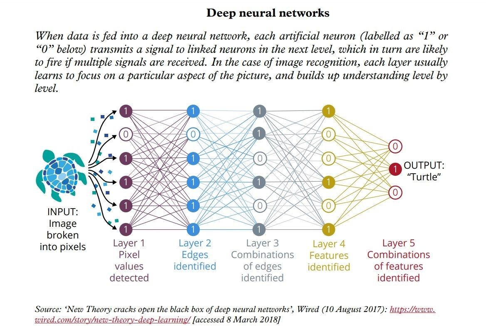

## Navigation 
- <a href = "https://connielee99.github.io/Explainable-AI-in-Finance">HomePage</a>
- <a href = "https://connielee99.github.io/Explainable-AI-in-Finance/abstract">Project Abstract</a>

## What is this project about?

 
  
   Deep Neural Networks with complicated architecture: <a href="https://i.pinimg.com/originals/b6/ca/80/b6ca80b8613110d1ac09790371c48e6b.jpg">Image Source</a>

  <b>Deep learning architectures</b> are now publicly recognized and repeatedly proven to be powerful in a wide range of high-level prediction tasks. While these algorithms’ modeling generally have beyond satisfactory performances with apposite tuning, the long-troubling issue of this specific learning lies in the un-explainability of model learning and predicting. This interpretability of “how” machines learn is often times even more important than ensuring machines outputting “correct” predictions. 
  
  Especially in the field of <b>Finance</b>, users’ ability to dissect how and why an algorithm reached a conclusion from a business standpoint is integral for later applications of i.e., to be incorporated for business decision making, etc. This project studies similar prior work done on image recognition in the financial market and takes a step further on explaining predictions outputted by the Convolutional Neural Network by applying the Grad-CAM algorithm.

