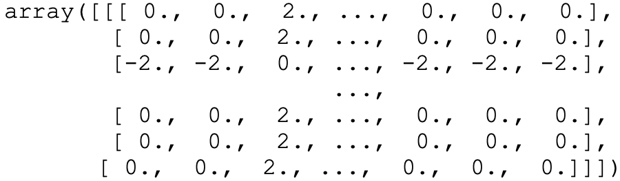

## Navigation 
- <a href = "https://connielee99.github.io/Explainable-AI-in-Finance">HomePage</a>
- <a href = "https://connielee99.github.io/Explainable-AI-in-Finance/abstract">Project Details</a>
  - <a href = "https://connielee99.github.io/Explainable-AI-in-Finance/introduction">Introduction</a>
  - <a href = "https://connielee99.github.io/Explainable-AI-in-Finance/stockmarket">Stock Market</a>
  - <a href = "https://connielee99.github.io/Explainable-AI-in-Finance/result">Prediction Result</a>
- <a href = "https://connielee99.github.io/Explainable-AI-in-Finance/methodology">Technical Methodology</a>
	- <a href = "https://connielee99.github.io/Explainable-AI-in-Finance/gaf">Gramian Angular Field</a> 
	- <a href = "https://connielee99.github.io/Explainable-AI-in-Finance/fastai">FastAI CNN Model</a>
	- <a href = "https://connielee99.github.io/Explainable-AI-in-Finance/gradcam">Grad-CAM Algorithm</a>

## What is this about?

	Our stock data is obtained in its original form of time series format. However, in order to apply our image recognition approach, it is necessary for information to be represented as image formats. 
	And Gramian Angualr Field is all about image time series data as image data! 
	

	     
		Source: <a href="https://www.google.com/url?sa=i&url=https%3A%2F%2Fdinhanhthi.com%2Ftime-series-tips%2F&psig=AOvVaw1kKcUJwJ1b3NaiVB4Qa96x&ust=1613374510800000&source=images&cd=vfe&ved=0CAIQjRxqFwoTCMjAk8ju6O4CFQAAAAAdAAAAABAa">Google Image</a> &nbsp;&nbsp;&nbsp;&nbsp;&nbsp;&nbsp;&nbsp;&nbsp;&nbsp; Source: <a href="https://www.google.com/url?sa=i&url=https%3A%2F%2Fillusticon.com%2F%3Fid%3D1000&psig=AOvVaw3Q0awEoO0yF6ICRFxsWIYQ&ust=1613374988591000&source=images&cd=vfe&ved=0CAIQjRxqFwoTCLiG76_w6O4CFQAAAAAdAAAAABAJ">Google Image</a>
		

## Gramian Angular Field

<b>Various steps of the Gramian Angular Field Conversion</b> Image developed by: <a href="https://medium.com/analytics-vidhya/encoding-time-series-as-images-b043becbdbf3">Louis de Vitry</a>

	Gramian Angular Field is an image obtained by transforming time series data. In GAF, <b><i>time series is represented in a polar coordinate system by taking advantage of the Gram Matrix <a href="https://arxiv.org/abs/1506.00327">(Oates and Zhiguang)</a></i></b> . Specifically, the Gram Matrix has a key advantage of preserving the temporal dependency -- <b><i>Since time increases as the position moves from top-left to bottom-right, the time dimension is encoded into the geometry of the matrix <a href=https://medium.com/analytics-vidhya/encoding-time-series-as-images-b043becbdbf3>(Vitry)</a></i></b>. 
	For demonstration, we continue with the example shown in <a href = "https://connielee99.github.io/Explainable-AI-in-Finance/stockmarket">Stock Market</a>, and display the transformed coordinate data by Gramian Angular Field from stock volatility on January 15th, 2021 as well as the actual image used for modeling converted from these polar coordinates. 
	

		<b>Polar Coordinate Representation of Price Volatility on 2021-01-15</b>    
		<b>Gramian Angular Field Image Representation of Price Volatility on 2021-01-15</b>   

### Interested in reading more? 
Please review our **Report**(add link to report later) for more detailed mathematical explanations!

	
