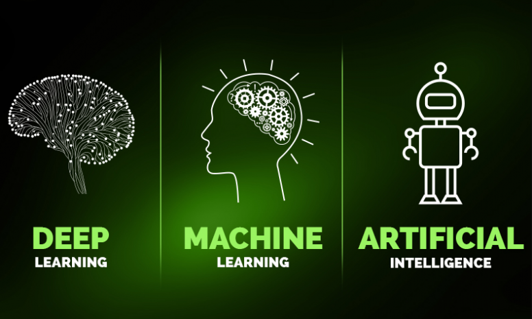

## Navigation 
- <a href = "https://connielee99.github.io/Explainable-AI-in-Finance">HomePage</a>
- <a href = "https://connielee99.github.io/Explainable-AI-in-Finance/abstract">Project Details</a>
  - <a href = "https://connielee99.github.io/Explainable-AI-in-Finance/introduction">Introduction</a>
  - <a href = "https://connielee99.github.io/Explainable-AI-in-Finance/stockmarket">Stock Market</a>
  - <a href = "https://connielee99.github.io/Explainable-AI-in-Finance/result">Prediction Result</a>
- <a href = "https://connielee99.github.io/Explainable-AI-in-Finance/methodology">Technical Methodology</a>
	- <a href = "https://connielee99.github.io/Explainable-AI-in-Finance/gaf">Gramian Angular Field</a> 
	- <a href = "https://connielee99.github.io/Explainable-AI-in-Finance/fastai">FastAI CNN Model</a>
	- <a href = "https://connielee99.github.io/Explainable-AI-in-Finance/gradcam">Grad-CAM Algorithm</a>

## Welcome to Explainable AI!

  <b>Explainable AI</b> stands for <b>Explainable Artificial Intelligence</b>. 
While many might understand or relate "Artificial Intelligence" to <b>Terminator</b> like this:

 
  
   Source from: <a href="https://shkspr.mobi/blog/wp-content/uploads/2018/07/The-Terminator-is-a-terrifying-metal-skeleton-with-glowing-red-eyes.jpg">Google Image</a>

Artificial Intelligence in actuality however does not directly refer to robotics, machineries, or intelligent bodies like such, but may be more appositely described as algorithms of various forms. 

    Source from: <a href="https://www.google.com/url?sa=i&url=https%3A%2F%2Fblog.altabel.com%2F2018%2F08%2F17%2Fdeep-learning-vs-machine-learning%2F&psig=AOvVaw0HgKLH9mP3vLK9ftHAkISH&ust=1613373634955000&source=images&cd=vfe&ved=0CAIQjRxqFwoTCODPvKXr6O4CFQAAAAAdAAAAABAD">Google Image</a>
  

  

In fact, Artificial Intelligence is a technical term with broad meanings, and includes many varied branches of studies -- with Deep Learning being at one of its cores. It is a function that mimics the workings of human brain neuro activities and is prevalently used in a number of prediction and recognition tasks today.   
This project therefore aims to make Artificial Intelligence, specifically Deep Learning, more interpretable to the great users -- to allow more trust and understandings into intelligent systems like such.
	

       Source from: <a href="https://www.google.com/url?sa=i&url=https%3A%2F%2Fwww1.nseindia.com%2Fproducts%2Fcontent%2Fequities%2Findices%2Fnifty_100.htm&psig=AOvVaw3R6NuMo2PGWINPoTxyLcyX&ust=1615224901395000&source=images&cd=vfe&ved=0CAIQjRxqFwoTCNCxo-bbnu8CFQAAAAAdAAAAABAD">Nifty 100 Logo</a>,  <a href="https://www.google.com/url?sa=i&url=https%3A%2F%2Fwww.dsjournal.com%2F2020%2F08%2F02%2Fdefense-and-aerospace-companies-report-2020-q2-earnings%2F&psig=AOvVaw175nH848EEn-N21O2ZTE08&ust=1613293581122000&source=images&cd=vfe&ved=0CAIQjRxqFwoTCIjZ49b_5u4CFQAAAAAdAAAAABAD">Stock</a>
  

Excitingly, this project forms its basis on <b>NIFTY 100's Stock Predictions</b> and today, we not only make stock forecasting with machine learning accessible to everybody, but also make these projected outcomes <b>INTERPRETABLE</b>!

### Support or Contact

Interested in learning more? Check out our [Documentation](https://github.com/leeso1718/StockMarket_explainableAI) or contact us @
- [Sohyun Lee](mailto:sol107@ucsd.edu)
- [Shin Ehara](mailto:sehara@ucsd.edu)
- [Jou-Ying Lee](mailto:jol067@ucsd.edu)

