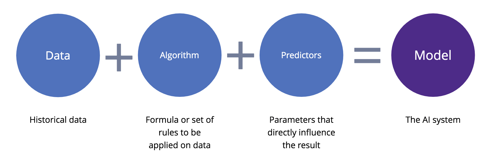

## Navigation 
- <a href = "https://connielee99.github.io/Explainable-AI-in-Finance">HomePage</a>
- <a href = "https://connielee99.github.io/Explainable-AI-in-Finance/abstract">Project Details</a>
  - <a href = "https://connielee99.github.io/Explainable-AI-in-Finance/introduction">Introduction</a>
  - <a href = "https://connielee99.github.io/Explainable-AI-in-Finance/stockmarket">Stock Market</a>
  - <a href = "https://connielee99.github.io/Explainable-AI-in-Finance/result">Prediction Result</a>
- <a href = "https://connielee99.github.io/Explainable-AI-in-Finance/methodology">Technical Methodology</a>
	- <a href = "https://connielee99.github.io/Explainable-AI-in-Finance/gaf">Gramian Angular Field</a> 
	- <a href = "https://connielee99.github.io/Explainable-AI-in-Finance/fastai">FastAI CNN Model</a>
	- <a href = "https://connielee99.github.io/Explainable-AI-in-Finance/gradcam">Grad-CAM Algorithm</a>

## What did we do?

	 
	 Source from: <a href = "https://www.google.com/url?sa=i&url=https%3A%2F%2Fwww.flaticon.com%2Ffree-icon%2Fneural_2103658&psig=AOvVaw3t5nNCkWAg1mfPkWdOJYS2&ust=1613372951333000&source=images&cd=vfe&ved=0CAIQjRxqFwoTCMiVs-Lo6O4CFQAAAAAdAAAAABAM">Google Image</a>
	

	

While most prevalent approaches to stock prediction might base around modelling with time series data, this research purposefully structures this attempt as an image classification task – both to explore deep learning algorithms’ capability on learning non-conventional images, and to inspect explainability of these neural networks. 

## How did we do it?

<b>Prediction Model</b> 
	
	 Source from: <a href = "https://www.google.com/url?sa=i&url=https%3A%2F%2Fwww.zoho.com%2Fcreator%2Fnewhelp%2Fforms%2Ffields%2Fprediction%2F&psig=AOvVaw0RDx95XJPea_VQKHV0ufZH&ust=1613371512189000&source=images&cd=vfe&ved=0CAIQjRxqFwoTCOD3o7Pj6O4CFQAAAAAdAAAAABAD">Google Image</a>
	

1. Encode time series data as images via [Gramian Angular Field](https://connielee99.github.io/Explainable-AI-in-Finance/gaf). 
2. Train [CNN model](https://connielee99.github.io/Explainable-AI-in-Finance/fastai) for pattern learning. 
3. Apply [Grad-CAM](https://connielee99.github.io/Explainable-AI-in-Finance/gradcam) algorithm over the learned CNN model for visual explanations. 
