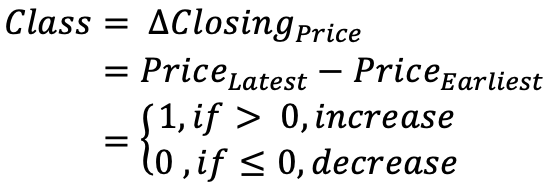

## Navigation 
- <a href = "https://connielee99.github.io/Explainable-AI-in-Finance">HomePage</a>
- <a href = "https://connielee99.github.io/Explainable-AI-in-Finance/abstract">Project Details</a>
  - <a href = "https://connielee99.github.io/Explainable-AI-in-Finance/introduction">Introduction</a>
  - <a href = "https://connielee99.github.io/Explainable-AI-in-Finance/stockmarket">Stock Market</a>
  - <a href = "https://connielee99.github.io/Explainable-AI-in-Finance/result">Prediction Result</a>
- <a href = "https://connielee99.github.io/Explainable-AI-in-Finance/methodology">Technical Methodology</a>
	- <a href = "https://connielee99.github.io/Explainable-AI-in-Finance/gaf">Gramian Angular Field</a> 
	- <a href = "https://connielee99.github.io/Explainable-AI-in-Finance/fastai">FastAI CNN Model</a>
	- <a href = "https://connielee99.github.io/Explainable-AI-in-Finance/gradcam">Grad-CAM Algorithm</a>

## Stock Market

The stock market is undoubtedly one of the most unpredictable, yet most popular areas for financial investment. Through facilitating exchanges of securities between buyers and sellers, this marketplace creates opportunities of capital gain for participants ranging from small individuals to big entities such as banks or conglomerates.

 
  
   Source from: <a href="https://www.google.com/url?sa=i&url=https%3A%2F%2Fwww.nseindia.com%2F&psig=AOvVaw0LlyWlHOjM2IkaweHbaZqs&ust=1615225261667000&source=images&cd=vfe&ved=0CAIQjRxqFwoTCJCIjJLdnu8CFQAAAAAdAAAAABAD">National Stock Exchange of Indea, Ltd.</a>

## Stock Market Price Change (Label)

	While there are countless financial measures in security discussions, this study focuses on one of the most direct assessments, i.e., the closing stock price. “The closing price is considered the most accurate valuation of a stock or other security until trading resumes on the next trading day” and is defined as “the last price at which the stock traded during the regular trading day” (Kenton). 

  As we purposefully structured this project as a classification task, this target for investigation is therefore transformed to be introduced as a binary label for model learning. For our project’s investigation purposes, we assign one class only to each day to represent trades that happen on that day. In specific, we compare the opening price to the closing price of a specific day in order to make a careful call on assigning an “increase” or “decrease” label to the combined daily stock entries.

  The India’s National Market Exchange market opens on 9:15 AM, and marks market closing on 3:30 PM across weekdays. We turned away from traditional considerations on pre-market hours and after-market hours for study, and adapted our target of investigation to be the price difference between the earliest opening price and latest closing price trading entries during a day. If this difference is of a positive output that signals an “increase” in stock value, while a negative output suggests the opposite. Therefore, summarizing that described above, given a particular day, we have our binary labels represented as the following:

 
  

## Tesla Stock Data

	Tesla's stock market (<i>Ticker: <b>TSLA</b></i>) is hand-picked to be the target of study for this project! The company’s stock market has been traded with high volume, and has been at the center of investor's discussions.
	
 
  
   Source from: <a href="https://www.google.com/url?sa=i&url=https%3A%2F%2Ftwitter.com%2Fteslanetapp&psig=AOvVaw3yq5p5CD2wGKiF0f8qAkje&ust=1613366359782000&source=images&cd=vfe&ved=0CAIQjRxqFwoTCMC20ZvQ6O4CFQAAAAAdAAAAABAJ">Image Source</a>

	 The following figure shows the closing price of <i>TSLA</i> from 2019-1-30 to 2021-01-15. Judging by the high volatility this time series trend displays, we believe <i>TSLA</i> would be a suitable and interesting subject for study.  
	
 
	<b>Closing Price of TSLA from 2019-1-30 to 2021-1-15</b> 
   

<b><i>In principle, the volatility should be high when there is a large price movement <a href = "towardsdatascience.com/image recognition-vs-other-techniques-in-predicting-the-financial-market-55548d4cda4">(Bai)</a></i></b>. This can be shown via an example (and we take data from January 15th, 2021 for demonstration).

By comparing the original closing price of TSLA on January 15th, 2021 as well as the volatility on these prices during the same period, We can observe that the stock volatility tends to be the highest right after the market open and to be lower during the pre-market session compared to the market hours.

 
	<b>Closing Price of TSLA on 2021-01-15</b> 
   
	<b>Price Volatility of TSLA on 2021-01-15</b> 
   

This project's prediction task therefore builds upon this observation and the understanding that <i>pre-market stock volatility might be a helpful indicator for market behaviors after market open</i>. We then demonstrate this via research into modelling these stock volatilities with CNN recognition.

