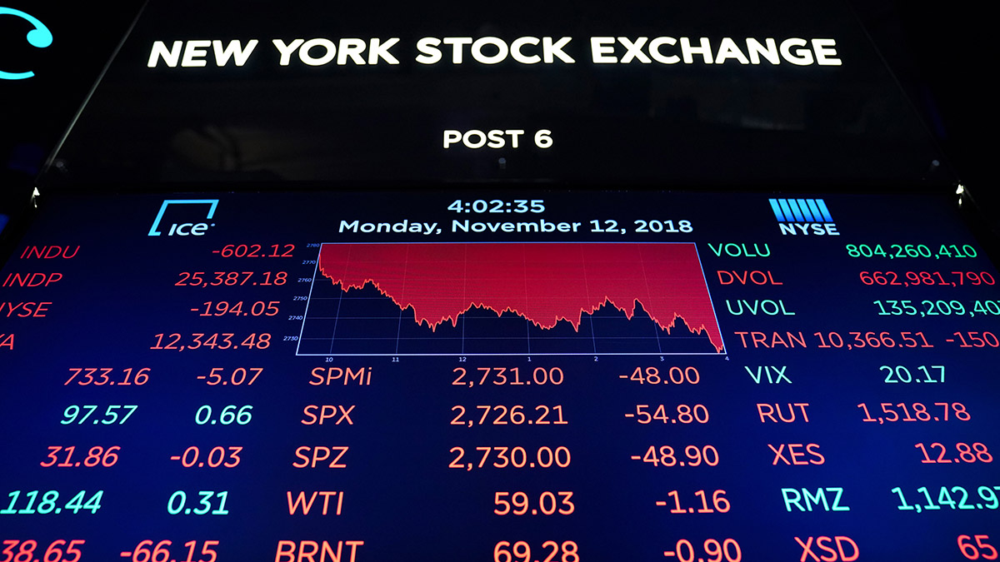

## Navigation 
- <a href = "https://connielee99.github.io/Explainable-AI-in-Finance">HomePage</a>
- <a href = "https://connielee99.github.io/Explainable-AI-in-Finance/abstract">Project Details</a>
  - <a href = "https://connielee99.github.io/Explainable-AI-in-Finance/introduction">Introduction</a>
  - <a href = "https://connielee99.github.io/Explainable-AI-in-Finance/stockmarket">Stock Market</a>
- <a href = "https://connielee99.github.io/Explainable-AI-in-Finance/methodology">Technical Methodology</a>
	- <a href = "https://connielee99.github.io/Explainable-AI-in-Finance/fastai">FastAI CNN Model</a>
	- <a href = "https://connielee99.github.io/Explainable-AI-in-Finance/fastai">Grad-CAM Algorithm</a>
- <a href = "https://connielee99.github.io/Explainable-AI-in-Finance/discussion">Discussion & Conclusion</a>

## Stock Market

	  The stock market is undoubtedly one of the most unpredictable, yet most popular areas for financial investment. Through facilitating exchanges of securities between buyers and sellers, this marketplace creates opportunities of capital gain for participants ranging from small individuals to big entities such as banks or conglomerates.

 
  
   Source from: <a href="https://www.google.com/url?sa=i&url=https%3A%2F%2Fwww.marketplace.org%2F2019%2F09%2F05%2Flets-break-down-the-numbers%2F&psig=AOvVaw0389PgAa1I2S2U6pMbcYAX&ust=1613316742432000&source=images&cd=vfe&ved=0CAIQjRxqFwoTCLDA5LSX5-4CFQAAAAAdAAAAABAD">NY Stock Exchange</a>

## Stock Volatility

	Volatility of the stock market <i><b>is a statistical measure of the dispersion of returns for a given security of market index. In most cases, the higher the volatility, the riskier the security <a href = "https://www.investopedia.com/terms/v/volatility.asp">(Investopedia)</a></b></i>. Stability of prices is therefore a key factor for investors to review – for the less risky an option is, the more predictable it gets, and thereby the easier it is for one to judge if such investment might be profitable or not.
	
In particular, we choose to monitor the price volatility before and after market opens. As prior work has suggested, <i><b>the volatility in the pre-market session might be a good indication of what might happen immediately after the market is open <a href = "towardsdatascience.com/image recognition-vs-other-techniques-in-predicting-the-financial-market-55548d4cda4">(Bai)</a></b></i>, and therefore is selected as the factor for prediction in the stock market. 

In context of our work, stock volatility is also carefully defined after prior research and structured to incorporate our need on measuring the stock variance. In specific, we capture characteristics of time series data by <i><b>approximating the volatility by using the high price minus the low price within the minute bar, and apply a rolling mean window of size N <a href = "towardsdatascience.com/image recognition-vs-other-techniques-in-predicting-the-financial-market-55548d4cda4">(Bai)</a></b></i>.

\begin{align*}
\frac{1}{2}
\end{align*}

### Support or Contact

Having trouble with Pages? Check out our [documentation](https://docs.github.com/categories/github-pages-basics/) or [contact support](https://support.github.com/contact) and we’ll help you sort it out.
